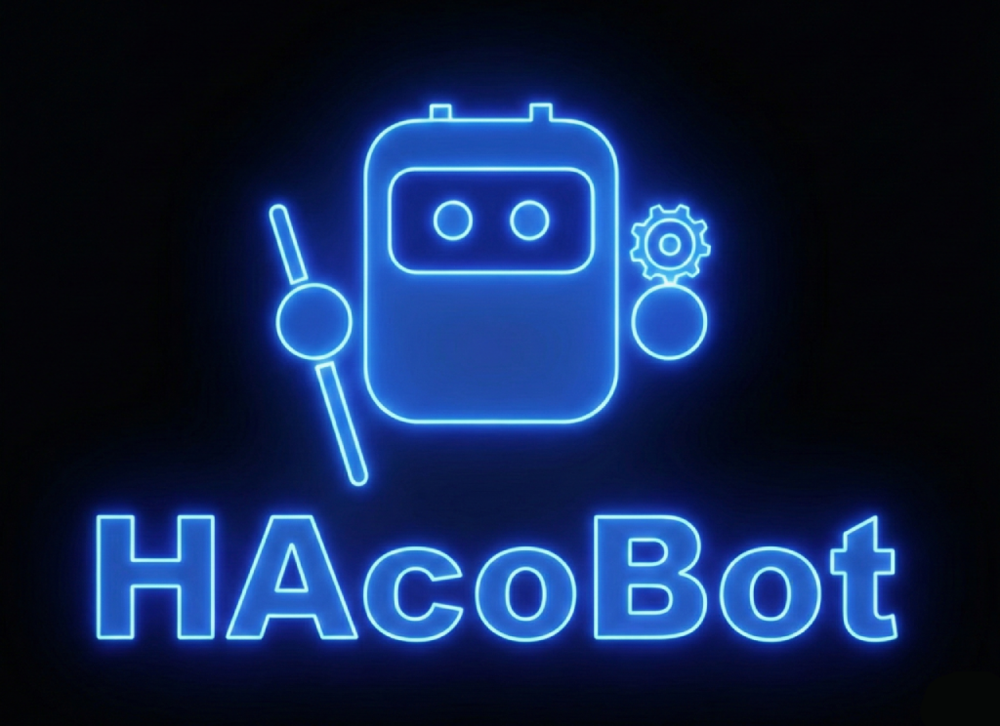

---

# Welcome to HAcoBot 🤖

HAcoBot (Home Assistant Command Bot) is an advanced, AI-powered admin agent for Home Assistant.

It goes far beyond simple voice commands like "Light on". HAcoBot integrates deeply into your system to handle complex tasks autonomously.

## What makes HAcoBot special?

Unlike traditional voice assistants (like Alexa or Google Assistant), HAcoBot offers significantly more control and depth:

### System Access
HAcoBot can write YAML files, create automations, and build dashboards.

### A Memory
It remembers information about you, your home, and your preferences.

### Proactivity
HAcoBot analyzes logs, detects issues early, and warns you e.g. about empty batteries or faulty automations.

### Freedom of Choice
You decide which AI ("Brain") is used – from Google Gemini to local Ollama.

## Next Step

👉 **Get started with Installation**

## Development
HAcoBot lives and improves through the community.
If you want to actively help or have a problem, please report it via GitHub:

- Create a **Prompt Issue**
- Describe your prompt as precisely as possible
- Add logs or screenshots if necessary
- Prompts MUST always be concise!
